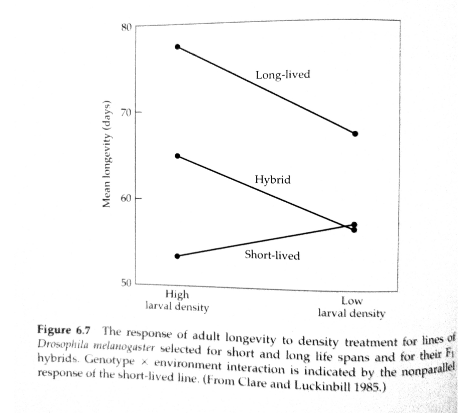

# Quantitative Genetics

## Sources of Environmental Variation

<small>
Instructor: [A Augusto F Garcia](http://augustogarcia.me)
/ [Statistical Genetics Lab](http://statgen.esalq.usp.br) </small>

<small>Department of Genetics, Luiz de Queiroz College of Agriculture,
University of São Paulo (Brazil)</small>

*** =pnotes

Some notes on the first slide

---

# Content

### Extension of the Linear Model
### Special Environmental Effects
### Repeatability
### Genotype $\times$ Environment Interaction

---

# Extension of the Linear Model

- Just like for the genetic term, environmental variance can also be
  partitioned
- **General environmental effects**: factors that are shared by groups
  of individuals
- **Special environmental effects**: residual deviations from the
  phenotype expected on the basis of genotype and general
  environmental effects

---

## Linear Model

$$z_{ijk} = G_i+I_{ij}+E_j+\epsilon_{ijk}$$

- $I_{ij}$: residual deviation left after assuming that genotype and
  environmental values act in and additive fashion
- ($k$: replications)

---

## Linear Model

$$\sigma^2_P=\sigma^2_G+\sigma^2_I+2\sigma_{G,E}+\sigma^2_E+\sigma^2_{\epsilon}$$

- $\sigma_{G,E}$: genotype-environment covariance

---

# Special Environment Effects

### Within-individual variation

- For example, asymmetry (flowers, leaves, etc)
- Left-right side of animals
- Variation within and among individuals
$$\sigma^2_{\epsilon}=\sigma^2_{ew}+\sigma^2_{ea}$$

---

# Repeatibility

- Variance on repeated measures on the same individual can only be due
  to environmental causes
- Within-variance can provide some insights on the possible magnitude
  of variance for a trait
- An upper-bound estimate of the genetic variance of a trait is
$$Var(G)_{max}=Var(z)-Var(ew)$$
- ($Var(z)$ includes $\sigma^2_{ea}$ and $\sigma^2_E$)
- **Repeatability** (an upper-bound to $H^2$)
$$r=\frac{Var(z)-Var(e_w)}{Var(z)-Var(e_m)}$$
- $Var(e_m)$: variance associated with measurement error

---

# Genotype $\times$ Environment Interaction

- $G \times E$ indicates that different genotypes respond to
  environmental change in different ways

---

--- ds:indigo

# Homework

  - Read Chapter 6 of Lynch and Walsh Book
